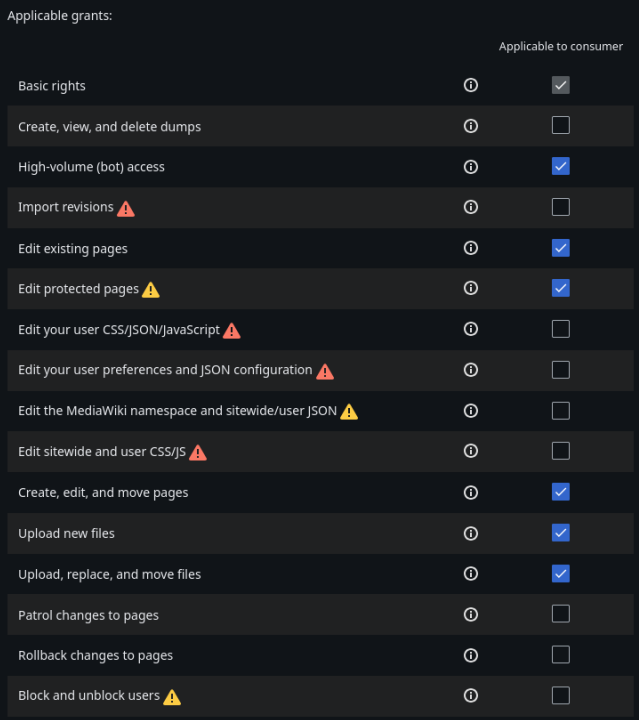

# Technical Documentation

> [!WARNING]
> This documentation is only for contributors. Please refer to [README.md](README.md) for information on the bot.

## Setup for Miraheze wikis

Requirements:
* The *TemplateStyles*, *TemplateData* (optional), *TemplateStylesExtender* and *ParserFunctions* extensions need to be enabled.

1. Grant the bot account (IRWABot) the `bot` user group.
    a. If the bot account is not present on the wiki, please ping @abaddriverlol on the discord server.
2. Add the wiki to `wikis.json` with the access token being set to `MIRAHEZE_ACCESS_TOKEN`.

## Setup for 3rd-party-wikis

Requirements:
* https://www.mediawiki.org/wiki/Extension:ParserFunctions
* https://www.mediawiki.org/wiki/Extension:TemplateData (not really required, will just create a mess on the template page if missing)
* https://www.mediawiki.org/wiki/Extension:TemplateStyles
* https://www.mediawiki.org/wiki/Extension:TemplateStylesExtender
* https://www.mediawiki.org/wiki/Extension:OAuth

1. Create a bot account on your wiki, give it the *bot* and *confirmed* user groups and log in with it.
2. Go to *Special:OAuthConsumerRegistration* on your wiki.
3. Click "Request a token for a new OAuth 2.0 client.".
4. Enter the following into the form:
    1. Application name: `Independent Roblox Wiki Alliance Bot`
    2. Consumer version: `1.0`
    3. Application description: `Bot used for synchronizing templates across multiple wikis that are part of the of the Roblox Wiki Alliance.`
    4. Check `This consumer is for use only by <bot username>.`
    5. Make sure `Client is confidential` is checked.
    6. Set `Types of grants being requested` to `Request authorization for specific permissions.`.
    7. Check the following grants:
      
    8. Leave the `Allowed pages for editing` field empty.
    9. Propose the consumer.
5. Save the generated access token and add it to the repository secrets.
6. Add the wiki to `wikis.json` and specify to the access token secret you added in step 5.
